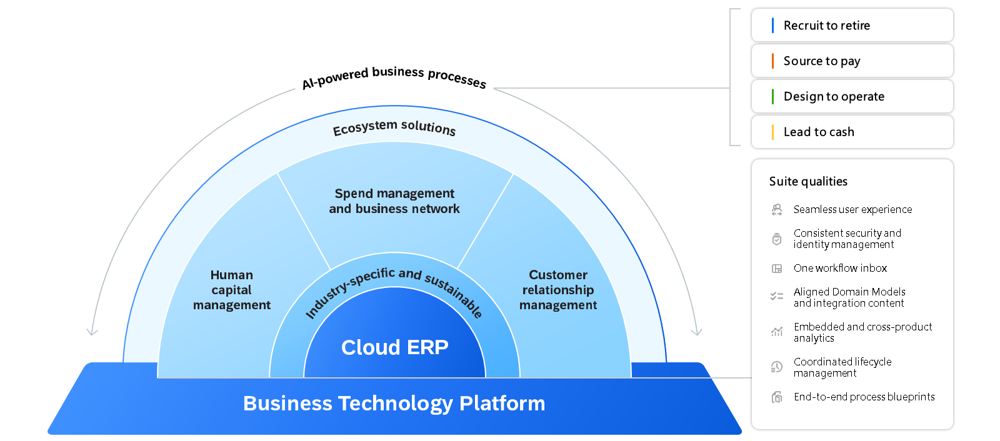

# Manual SAP Business Technology Platform

## Estrategia de SAP: Descripción General

### Ilustrando la Empresa Inteligente

**Transformación Empresarial con SAP: Escenarios**

1. **Nuevo Cliente (Escenario A):**
   - Empresa no cliente de SAP.
   - Interesada en estrategia inteligente y sostenible.
   - Implementación desde cero con SAP S/4HANA Cloud.

2. **Cliente Existente (Escenario B):**
   - Cliente SAP con historial en SAP Business Suite.
   - Migración a SAP S/4HANA Cloud.
   - Transformación antes del fin de soporte.
   - Uso de RISE con SAP para acelerar.
   - Enfoque industrial, extensiones y desarrollo personalizado en SAP Business Technology Platform.

**Objetivo de la Estrategia SAP: Empresa Inteligente y Sostenible**

# Estrategia de SAP para Empresas Inteligentes y Sostenibles

## Definición

Una empresa inteligente y sostenible es aquella que aplica tecnologías avanzadas y mejores prácticas en procesos ágiles e integrados.

## Cómo SAP Contribuye

1. **Capa Tecnológica Consistente:**
    - Utilizar SAP Business Technology Platform.

2. **Integración de IA y Aprendizaje Automático:**
    - Mejorar procesos comerciales.

3. **Herramientas de Análisis Empresarial:**
    - Comprender eventos y causas en la empresa.

4. **Cadenas de Valor Flexibles:**
    - Aplicar prácticas industriales avanzadas.

5. **Procesos Verticales en la Nube:**
    - Ejecutar cadena de valor completa.

## Visión

- Conexión entre plataforma tecnológica y aplicaciones.
- Empresas mejor administradas son inteligentes y sostenibles.
- Rompen silos, adoptan procesos multifuncionales para experiencias óptimas.

# Descubriendo la Terminología de la Nube

## **Nube (Cloud):**
   - Infraestructura y servicios disponibles a través de Internet.

## **Computación en la Nube (Cloud Computing):**
   - Oferta de servicios de computación a través de la nube.

## **Modelos de Implementación:**
   - **Nube Pública:**
      - Servicios disponibles para el público en general.
   - **Nube Privada:**
      - Infraestructura utilizada exclusivamente por una organización.
   - **Nube Híbrida:**
      - Combinación de nube pública y privada.

## **Modelos de Servicio:**
   - **IaaS (Infraestructura como Servicio):**
      - Recursos de infraestructura disponibles como servicio.
   - **PaaS (Plataforma como Servicio):**
      - Plataforma de desarrollo y despliegue de aplicaciones.
   - **SaaS (Software como Servicio):**
      - Aplicaciones accesibles a través de la nube.

## **Regiones de la Nube:**
   - Áreas geográficas con centros de datos.

## **Hiperescaladores:**
   - Grandes proveedores de servicios de nube (AWS, Azure, Google Cloud).

## **Multinube:**
   - Uso de servicios de múltiples proveedores de nube.

## **Virtualización:**
   - Creación de recursos virtuales en lugar de físicos.

## **Contenedores:**
   - Empaquetamiento de aplicaciones y sus dependencias.

## **SAP y la Nube:**
   - Foco en transformación hacia la nube.

¡Explora el mundo de la nube con confianza!

# Hiperescalador y Colaboración con SAP y SAP BTP

## Hiperescalador

**Definición:**
- Proveedor de servicios de nube a gran escala.

## Hiperescaladores Asociados con SAP y SAP BTP

### Principales Hiperescaladores:

- AWS, Microsoft Azure, Google Cloud Platform, Alibaba Cloud.

### Colaboración con SAP:

- SAP se asocia con estos hiperescaladores para ofrecer la mejor oferta y disponibilidad.

### Enfoque en SAP BTP:

- SAP Business Technology Platform (BTP) es destacado en esta colaboración.

### Disponibilidad de SAP BTP:

- Disponible en múltiples regiones con los proveedores mencionados.

### Paisajes de Múltiples Nubes:

- SAP respalda paisajes de múltiples nubes a través de esta colaboración.

### Centros de Datos:

- SAP, junto con hiperescaladores, ofrece centros de datos en varias regiones, como Europa, Este de EE. UU., Oeste de EE. UU., Singapur, entre otras.

### Operación de Software:

- SAP opera software en sus propios centros de datos, utilizando una arquitectura similar a un hiperescalador para mayor resiliencia y flexibilidad.

### Elección de Ejecución:

- La ejecución de una solución SAP en centros de datos de SAP o en recursos de hiperescalador depende del producto y su arquitectura.

# Modelos de Implementación y Modelos de Servicio en la Nube

## Modelos de Implementación

### 1. Nube Pública:

- **Definición:**
  - Servicios disponibles para el público en general.

### 2. Nube Privada:

- **Definición:**
  - Infraestructura utilizada exclusivamente por una organización.

### 3. Nube Híbrida:

- **Definición:**
  - Combinación de nube pública y privada.

## Modelos de Servicio

### 1. IaaS (Infraestructura como Servicio):

- **Definición:**
  - Recursos de infraestructura disponibles como servicio.

### 2. PaaS (Plataforma como Servicio):

- **Definición:**
  - Plataforma de desarrollo y despliegue de aplicaciones.

### 3. SaaS (Software como Servicio):

- **Definición:**
  - Aplicaciones accesibles a través de la nube.

**Explora las opciones de implementación y servicios en la nube para adaptarte a las necesidades de tu empresa.**

# Gestión de Procesos de Negocio con SAP Signavio

## Gestión de Procesos de Negocio (BPM) con SAP Signavio

- **Importancia del Tiempo para Comprender y Adaptarse:**
  - Clave para la transformación hacia una empresa inteligente y sostenible.
  - Implica la gestión flexible de procesos y la percepción del modelo operativo.

- **Desafíos Comunes Durante Transformaciones Empresariales:**
  - Falta de apoyo y comunicación.
  - Resistencia organizacional y falta de alineación estratégica.
  - Falta de visibilidad de datos, tecnología y rendimiento de procesos.

- **Rol de SAP Signavio en Superar Desafíos:**
  - Ayuda a enfrentar desafíos y lograr un tiempo excelente para comprender y adaptarse.

- **Objetivo de BPM: Mejorar Rendimiento Empresarial:**
  - Uso de soluciones como SAP Signavio Process Manager para estructurar, modelar y analizar procesos.

- **Disciplina de Gestión de Procesos de Negocio:**
  - Captura de información, diseño, ejecución, documentación y medición de procesos.

- **Perspectiva de Gestión Orientada a Procesos:**
  - Enfoque de extremo a extremo para empresas de todos los tamaños e industrias.

- **Integración con Transformación Empresarial:**
  - La gestión de procesos se integra con la transformación hacia una empresa inteligente y sostenible.

- **Información Clave para Excelencia del Proceso:**
  - Recopilación de datos para afinar y aclarar procesos.

- **Automatización y Transformación Empresarial:**
  - Comprender y automatizar procesos, parte integral de la transformación.

- **Recursos Adicionales de Aprendizaje:**
  - Viajes de aprendizaje dedicados para configurar, ejecutar y diseñar con SAP Signavio.

- **Conclusión:**
  - Procesos de extremo a extremo son esenciales para una empresa inteligente y sostenible.
  - BPM, con soluciones como SAP Signavio, mejora el rendimiento y contribuye a la excelencia del proceso.

# Soluciones para una Empresa Inteligente y Sostenible

## Núcleo Central

- SAP S/4HANA Cloud como el corazón central del Cloud ERP.

## Áreas Cubiertas por Soluciones

- Gestión de Recursos Empresariales.
- Gestión de Gastos.
- Gestión del Capital Humano.
- Gestión de Relaciones con Clientes, entre otras.

## Capa de Soluciones Empresariales

- Cloud ERP - SAP S/4HANA Cloud como núcleo central.
- Rodeado de otras soluciones de SAP y posiblemente aplicaciones de terceros.

## Ejemplos de Soluciones

### 1. SAP Ariba

- Transformación digital para colaboración eficiente y segura con proveedores y socios comerciales.
- Gestión de compras, control de gastos y construcción de una cadena de suministro saludable.
- Información basada en datos y automatización.

### 2. SAP Concur

- Servicios de gestión de gastos y viajes.
- Simplificación de gestión en la nube con mayor visibilidad.

### 3. Experiencia del Cliente SAP

- Oferta integrada para modernizar funciones de front-office, incluyendo protección de datos, marketing, comercio, ventas y servicio al cliente.

### 4. Factores de Éxito de SAP - Suite HXM

- Gestión de Experiencia Humana (HXM) que se centra en experiencias que sirven a los empleados.
- Cubre desde recursos humanos básicos hasta los pilares de gestión del talento.

## Enlace Adicional

- SAP S/4HANA como solución ERP central: [Detalles](https://www.sap.com/products/human-resources-hcm.html).

## Conclusiones Clave

- Áreas de soluciones son elementos clave en una empresa inteligente y sostenible.
- SAP S/4HANA Cloud como núcleo central junto con un portafolio amplio de funcionalidades en la nube.  

# SAP Business Technology Platform (BTP)

## Naturaleza de la Plataforma

- Plataforma como Servicio (PaaS) abierta.

## Ofrece Capacidades en

- Memoria.
- Servicios de Plataforma Central.
- Servicios Únicos.

## Propósito de la Plataforma

- Crear y Ampliar Aplicaciones en la Nube.
- Aplicaciones Inteligentes y Habilitadas para Dispositivos Móviles.

## Objetivo Principal

- Acelerar la Transformación Digital.

## Ventajas Clave

- Desarrollo Rápido, Sencillo y Económico de Aplicaciones.
- No se requiere inversión en infraestructura local o en la nube.

## Rol en la Empresa Inteligente y Sostenible

- Base Tecnológica Fundamental.

## Enlace Adicional

- [SAP BTP en Detalle](https://www.sap.com/products/business-technology-platform.html).

## Conclusiones Clave

- SAP BTP sirve como la base tecnológica esencial para la construcción de una empresa inteligente y sostenible.
- Facilita el desarrollo ágil y rentable de aplicaciones precisas, sin necesidad de inversión en infraestructura.

# Principales Casos de Uso de SAP BTP en la Empresa Inteligente y Sostenible

## Basada en Estándares Abiertos

- Ofrece flexibilidad y control sobre la elección de hiperescaladores, marcos y aplicaciones.

## Casos de Uso en la Empresa Inteligente y Sostenible

- Utilizado para migración, integración, consolidación de datos y extensiones.

## Mantenimiento del Núcleo

- Mantenga el núcleo limpio y vuelva a la implementación predeterminada para soluciones locales.
- Cree y opere extensiones altamente integradas para personalizar procesos comerciales sin afectar el núcleo estable.

## Extensibilidad

- Permite la creación y mejora ágil de inversiones en aplicaciones para satisfacer necesidades cambiantes.
- Facilita la entrega rápida de nuevas funciones con SAP BTP como plataforma subyacente.

## Automatización de Procesos de Negocio

- Automatiza tareas y flujos de trabajo entre aplicaciones con SAP Build Process Automation.
- Herramienta basada en código bajo/sin código para expertos en negocios y desarrolladores.

## Automatización Robótica y Colaboración con SAP BPI

- Ofrece automatizaciones para tareas manuales mediante tecnologías de automatización robótica.
- Colaboración con SAP Business Process Intelligence (BPI) para análisis y toma de acciones directas.

## Decisiones Basadas en Datos

- Apoyo a usuarios empresariales con información y recomendaciones basadas en IA.
- Importancia de tener una visión consolidada de todos los activos de datos y una gestión eficiente para la toma de decisiones.

## Calidad y Manejo de Datos

- Buena calidad y manejo de datos son esenciales en un entorno empresarial flexible y escalable.
- Análisis e interpretación de datos clave para obtener valor de los mismos.

## Conclusiones Clave

- SAP BTP forma la base tecnológica de la empresa inteligente y sostenible.
- Facilita la integración de procesos, proporciona información de calidad para la toma de decisiones y contribuye a la agilidad del negocio.
